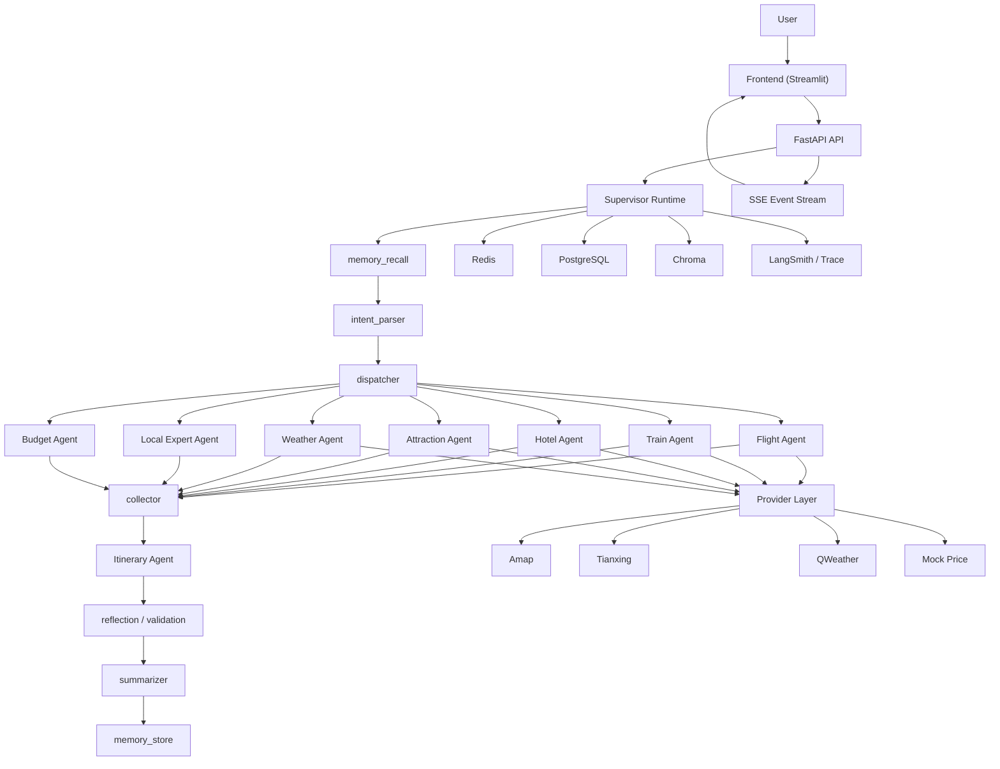

# 企业级 Supervisor 多代理旅行规划系统

## 1. 文档目的

本文档用于定义 `TripAI` 的目标形态：从当前“Coordinator + 并发分析 Agent”的实现，演进为一套可面向真实业务落地的 **企业级 Supervisor 多代理旅行规划系统**。

文档覆盖四类内容：

- 需求文档：功能范围、用户场景、验收标准
- 技术架构：系统分层、状态模型、Agent 通信、数据流
- 技术选型：为什么选这些组件，而不是相邻替代方案
- 执行计划：从当前仓库出发的分阶段实施路径

本文档不是简历包装稿，也不是 Demo 介绍页，而是后续开发、评审和验收的基线文档。

---

## 2. 项目定位

### 2.1 目标定位

系统面向“复杂旅行规划”场景，为用户提供从自然语言需求输入到可执行行程输出的完整闭环能力，核心覆盖：

- 多目的地旅行规划
- 交通、住宿、景点、天气、预算等多维决策
- 多 Agent 分工协作
- 流式反馈与任务可追踪
- 记忆、知识增强、失败降级、结果持久化

### 2.2 目标用户

- 自由行用户：需要一份多约束、多维度的完整旅行规划
- 家庭/多人出行用户：需要兼顾预算、节奏、成员偏好
- 商旅用户：需要兼顾效率、交通衔接和住宿稳定性
- 业务运营/产品人员：需要观察 Agent 执行链路、排查问题、分析成功率

### 2.3 产品目标

- 让用户输入自然语言后，系统能自动拆解任务并生成结构化旅行方案
- 让 Agent 的决策过程具备可观测性、可回放性和容错能力
- 让系统具备企业级后端特征，而不是单次调用大模型的脚本 Demo

---

## 3. 建设目标与非目标

### 3.1 建设目标

- 构建基于 LangGraph 的 Supervisor 多代理架构
- 接入国内旅行相关数据源，优先真实 API，必要处使用可替换 Mock
- 支持任务级 SSE 流式输出
- 支持短期记忆、长期知识增强、结果持久化
- 支持失败降级、重试、缓存、日志、追踪
- 支持后续作为简历项目和面试项目进行深入讲解

### 3.2 非目标

- 不追求 OTA 级别的实时交易闭环，如支付、出票、酒店下单
- 不在 V1 中实现多模态能力，如图片识别、语音输入、地图可视化拖拽
- 不在 V1 中承诺全量城市知识覆盖
- 不在 V1 中承诺复杂商家供给优化和动态竞价策略

---

## 4. 需求范围

### 4.1 P0 必须完成

- 自然语言旅行需求输入
- Supervisor 任务拆解与路由
- 领域子 Agent 执行
- 航班、火车、酒店、景点、天气查询
- 预算分析与行程整合
- 流式进度反馈
- 短期记忆与结果持久化
- Provider 抽象、缓存、重试、失败降级

### 4.2 P1 应该完成

- 本地知识增强 RAG
- 用户偏好继承
- 方案质量校验与自检
- 结构化日志和 LLM Trace
- 基础测试体系

### 4.3 P2 可延后完成

- 多轮长期画像记忆
- 路线优化和地图路径估算
- 成本评测与离线评估
- 人工确认节点
- 推荐理由解释模块

---

## 5. 用户视角需求

## 5.1 用户故事

### 用户故事 A：自由行用户

作为自由行用户，我希望输入“国庆去成都 4 天，预算 4000，想吃美食、逛博物馆、住市中心”，系统自动给出交通、住宿、景点和逐日安排，而不是只返回一段泛泛建议。

### 用户故事 B：多人家庭用户

作为家庭出行用户，我希望系统能考虑老人和小孩的节奏，不要安排过于紧凑的路线，并能在天气不好时自动调整室内备选方案。

### 用户故事 C：商旅用户

作为商旅用户，我希望系统重点优化出行效率、酒店位置和交通衔接，而不是生成太多休闲推荐。

### 用户故事 D：运营/开发人员

作为内部使用人员，我希望看到任务进度、哪个 Agent 在执行、哪个工具失败了、为什么最终结果不完整。

---

## 6. 功能需求

## 6.1 需求输入与意图理解

系统必须支持：

- 自然语言输入旅行需求
- 结构化表单输入
- 基本参数提取：目的地、时间、预算、人数、偏好
- 缺失信息识别与澄清

验收标准：

- 用户输入不完整时，系统能指出缺失字段
- 输入中出现相对时间表达时，系统能提示补充具体日期
- 用户输入支持中文表达，不要求固定模板

## 6.2 Supervisor 任务拆解

系统必须由 Supervisor 负责：

- 理解用户目标
- 拆解子任务
- 按需求分发到领域子 Agent
- 汇总子 Agent 结果

验收标准：

- 不是固定顺序 Pipeline，而是根据用户输入动态决定需要哪些子任务
- 对于“只看天气 + 酒店”的请求，不应强制跑全部 Agent
- 对于“多目的地”请求，允许拆出多个并行子任务

## 6.3 领域子 Agent

V1 子 Agent 设定如下：

- Flight Agent：航班查询
- Train Agent：高铁/火车查询
- Hotel Agent：酒店检索与参考价格
- Attraction Agent：景点推荐与 POI 查询
- Weather Agent：天气预报
- Local Expert Agent：本地知识和经验补充
- Budget Agent：预算分析与成本约束
- Itinerary Agent：逐日行程整合

说明：

- V1 中 Budget Agent 和 Itinerary Agent 可以在汇总阶段串行执行
- V2 可进一步拆分为独立图

验收标准：

- 每个子 Agent 只负责单领域问题，不混做全链路规划
- 子 Agent 至少具备“读任务 -> 调工具 -> 输出结构化结果”的闭环

## 6.4 工具与数据源

系统必须支持以下能力：

- 航班查询
- 火车查询
- 酒店检索
- 景点检索
- 天气查询
- 本地知识查询

数据源策略：

- 高德地图：酒店/景点 POI
- 天行数据：航班/火车
- 和风天气：天气
- 酒店价格：MockPriceProvider，预留真实接入能力
- 本地知识：Markdown + Chroma 检索

验收标准：

- 工具对 Agent 暴露统一调用接口
- 替换数据源时，不需要改 Agent 主逻辑
- API Key 缺失时，返回降级提示而不是全链路崩溃

## 6.5 行程生成与预算约束

系统必须支持：

- 汇总多个子 Agent 输出
- 生成逐日行程
- 给出预算拆分建议
- 在预算超限时给出降级建议

验收标准：

- 输出结果不只是原始工具列表，而是整合后的行程文案
- 当交通、酒店、景点预算不匹配时，系统能指出冲突项

## 6.6 流式输出与结果下载

系统必须支持：

- 任务创建后实时返回进度
- 显示当前正在执行的 Agent
- 显示工具调用事件
- 下载最终结果

验收标准：

- 前端可通过 SSE 展示任务进度
- 流式不可用时自动回退为轮询模式

## 6.7 记忆与知识增强

系统必须支持：

- 任务级短期记忆
- 本地知识 RAG
- 历史结果存储

P1 支持：

- 用户偏好继承
- 历史行程相似召回

验收标准：

- 同一次任务中，各 Agent 能读取共享事实
- Local Expert 输出应优先基于城市知识，而不是只依赖模型内置知识

## 6.8 可观测性与排障

系统必须支持：

- 结构化日志
- 任务事件流
- LLM 调用追踪
- 失败原因可回溯

验收标准：

- 至少能定位是哪个 Agent 失败、哪个工具失败、失败发生在哪个阶段

---

## 7. 非功能需求

## 7.1 可靠性

- 单个工具失败不应导致整条链路直接中断
- 单个子 Agent 失败时，应允许最终输出部分可用结果
- 外部 API 异常必须支持重试和降级

## 7.2 性能

- 普通规划任务应在可接受时间内完成
- 用户应在短时间内看到首个流式反馈
- 子任务应尽量并行执行

## 7.3 可维护性

- Agent 层、Tool 层、Provider 层必须分离
- 配置管理必须集中化
- 新增一个数据源，不应改动多处核心逻辑

## 7.4 可观测性

- 所有关键任务节点应产生日志和事件
- 关键 API 请求需要追踪耗时和结果状态

## 7.5 安全性

- API Key 不得硬编码
- 日志中不得输出敏感密钥
- 对用户输入进行基本校验

## 7.6 测试性

- Provider 层可单测
- Agent 路由可集成测试
- 持久化层可集成测试

---

## 8. 总体架构

## 8.1 分层架构

建议采用如下分层：

- 表现层：`frontend/`
- API 层：`backend/api_server.py`
- 编排层：`backend/supervisor/`、`backend/agents/`
- 工具层：`backend/tools/`
- 数据接入层：`apis/providers/`
- 横切层：`core/`
- 持久化层：`backend/storage/`
- 知识层：`SimpleExample-knowledge-rag/` + Chroma

## 8.2 系统架构图



---

## 9. 状态模型设计

## 9.1 SupervisorState

建议定义：

```text
SupervisorState
- task_id
- user_request
- extracted_facts
- missing_info
- sub_tasks[]
- agent_results{}
- collector_output
- itinerary_output
- reflection_output
- final_output
- task_status
- events[]
```

## 9.2 SubAgentState

建议定义：

```text
SubAgentState
- task_id
- agent_name
- subtask
- shared_facts
- messages
- tool_artifacts[]
- output
- status
- error
```

## 9.3 设计原则

- SupervisorState 负责跨 Agent 全局状态
- SubAgentState 负责单 Agent 本地执行状态
- 不让所有 Agent 直接共享一个杂糅的大对象
- 工具结果必须保留 `tool_artifacts`，用于排障和追踪

---

## 10. Agent 编排设计

## 10.1 Supervisor 图

V1 目标图：

```text
memory_recall
-> intent_parser
-> dispatcher
-> collector
-> itinerary
-> reflection
-> summarizer
-> memory_store
```

说明：

- `memory_recall`：回收历史偏好或历史方案摘要
- `intent_parser`：抽取用户核心约束并生成子任务
- `dispatcher`：决定要跑哪些 Agent
- `collector`：归一化各 Agent 输出
- `itinerary`：生成逐日行程
- `reflection`：检查预算、时间、逻辑冲突
- `summarizer`：输出最终方案
- `memory_store`：回写任务结果

## 10.2 子 Agent 执行范式

统一执行范式：

```text
receive_subtask
-> call_llm
-> invoke_tool
-> optional_retry_or_fallback
-> summarize_output
```

设计理由：

- 保证每个 Agent 模板一致
- 便于新增 Agent
- 便于测试和定位问题

## 10.3 并行策略

建议并行执行：

- Flight Agent
- Train Agent
- Hotel Agent
- Attraction Agent
- Weather Agent
- Local Expert Agent

Budget Agent 可视情况：

- 方案一：作为独立并行 Agent
- 方案二：在 Collector 后做二次计算

V1 推荐方案：

- 交通/住宿/景点/天气/本地知识并行
- 预算分析和行程生成在汇总后串行执行

---

## 11. 工具与 Provider 架构

## 11.1 设计原则

- Agent 不直接写 HTTP 请求
- Tool 不直接处理重试、缓存、日志等横切逻辑
- Provider 负责外部 API 访问和结果标准化

## 11.2 调用链

```text
Agent -> Tool -> Provider -> HTTP API
```

## 11.3 Provider 接口

建议沿用当前抽象：

```python
class BaseProvider(ABC):
    @abstractmethod
    def search(self, params: dict) -> list[dict]:
        ...
```

## 11.4 V1 Provider 列表

- `AmapHotelProvider`
- `AmapAttractionProvider`
- `TianxingFlightProvider`
- `TianxingTrainProvider`
- `QweatherProvider`
- `MockPriceProvider`

## 11.5 横切能力注入

每个 Provider 内部统一注入：

- 配置读取
- 重试
- 缓存
- 结构化日志
- 结果标准化

---

## 12. 记忆与知识架构

## 12.1 记忆分层

### 热状态

- 介质：Redis
- 内容：任务状态、事件流、短期记忆
- 生命周期：任务级，TTL 可配置

### 图状态

- 介质：开发环境 SQLite；生产环境建议 PostgreSQL 持久化
- 内容：Supervisor/Agent 执行快照、消息历史、路由状态

### 结果归档

- 介质：PostgreSQL
- 内容：最终方案、任务摘要、Agent 参与情况、Markdown 报告

### 语义知识

- 介质：Chroma
- 内容：本地城市知识、历史摘要、偏好画像

## 12.2 RAG 范围

V1 支持：

- 本地城市知识检索
- 景点/在地建议/注意事项补充

P1 支持：

- 历史相似行程召回
- 用户偏好继承

---

## 13. API 设计

建议保留并演进现有 API：

- `POST /plan`：创建任务
- `GET /status/{task_id}`：获取任务状态
- `GET /stream/{task_id}`：SSE 流式事件
- `GET /download/{task_id}`：下载结果
- `POST /chat`：自然语言意图解析

建议新增：

- `GET /tasks/{task_id}/events`
- `GET /tasks/{task_id}/artifacts`
- `POST /tasks/{task_id}/retry`
- `POST /tasks/{task_id}/cancel`

---

## 14. 前端交互设计

## 14.1 V1 前端目标

- 输入旅行需求
- 实时显示任务进度
- 展示当前 Agent 和工具调用状态
- 展示最终卡片化结果
- 下载 Markdown 报告

## 14.2 展示区块

- 任务概览
- 进度时间线
- Agent 执行面板
- 交通结果
- 酒店结果
- 景点结果
- 天气结果
- 预算建议
- 最终行程

## 14.3 交互要求

- SSE 断开自动退回轮询
- 任务完成后保留历史查询能力
- 避免把纯日志直接暴露给终端用户

---

## 15. 可观测性设计

## 15.1 日志

建议使用：

- `Loguru` 输出结构化 JSON 日志
- 控制台输出开发友好日志
- 文件日志保留轮转和过期策略

## 15.2 指标

至少记录：

- 任务总耗时
- Agent 耗时
- 工具调用成功率
- Provider 响应耗时
- SSE 首包时间
- 任务完成率

## 15.3 Trace

建议：

- 开发阶段接入 LangSmith
- 企业内网部署时，逐步补 OpenTelemetry / APM

---

## 16. 容错与降级设计

## 16.1 分层容错

- Provider 层：网络异常重试
- Tool 层：返回降级结果而非直接抛错
- Agent 层：单工具失败不阻塞该 Agent 其他工具
- Supervisor 层：单 Agent 失败不阻塞整条链路

## 16.2 降级策略

- 天气 API 不可用：回退到 MCP 或搜索结果
- 酒店价格不可用：回退到参考价说明
- 景点数据不足：回退到本地知识和通用建议
- 某个 Agent 失败：在最终方案标记“该维度信息暂不完整”

---

## 17. 安全与配置设计

## 17.1 配置管理

建议统一收敛到 `core/config.py`：

- LLM 配置
- API Key
- 持久化配置
- Trace 配置
- 重试/缓存配置

## 17.2 安全要求

- `.env` 不入库
- 日志中脱敏密钥
- 对输入内容做长度和基本格式校验
- 对外部响应做空值和异常保护

---

## 18. 技术选型与理由

## 18.1 Agent 编排：LangGraph

选择理由：

- 可手写状态图
- 条件路由明确
- 易于插入业务逻辑
- 支持检查点和流式能力

不选 CrewAI/AutoGen 的原因：

- 更偏黑盒协作
- 细粒度控制弱于 LangGraph
- 不利于面试中讲清楚“状态机级别的设计”

## 18.2 API 框架：FastAPI

选择理由：

- 与异步、SSE、Pydantic 结合自然
- 易于暴露任务型接口
- 更适合 AI 应用服务化场景

## 18.3 前端：Streamlit

V1 继续使用的理由：

- 迭代快
- 与当前仓库一致
- 足够支撑 Demo 到内部使用场景

后续如果转产品化，可考虑独立 Web 前端。

## 18.4 配置：pydantic-settings

选择理由：

- 启动期校验
- 配置集中化
- 减少运行期隐性错误

## 18.5 日志：Loguru

选择理由：

- 接入成本低
- JSON 日志方便检索
- 与当前 Python 项目协同简单

## 18.6 重试：Tenacity

选择理由：

- 指数退避实现简单
- 适合 Provider 层统一封装

## 18.7 缓存：Redis + 本地缓存

V1 建议：

- 开发环境可保留 `DiskCache`
- 生产环境建议以 Redis 为共享缓存主方案

原因：

- DiskCache 适合本地开发
- 企业级多实例部署需要共享缓存

## 18.8 持久化：PostgreSQL

选择理由：

- 结构化结果归档适合关系型存储
- 后续便于任务检索、统计和审计

## 18.9 热状态：Redis

选择理由：

- 适合任务状态、事件流、短期会话态
- 与 SSE 推送、任务查询天然匹配

## 18.10 知识库：Chroma

选择理由：

- 足够支撑本地知识检索
- 接入简单
- 与当前知识语料结构匹配

---

## 19. 目标目录结构

```text
TripAI/
├── apis/
│   ├── base.py
│   └── providers/
├── core/
│   ├── config.py
│   ├── logging.py
│   ├── retry.py
│   └── cache.py
├── backend/
│   ├── api_server.py
│   ├── supervisor/
│   │   ├── graph.py
│   │   ├── state.py
│   │   ├── router.py
│   │   └── prompts.py
│   ├── agents/
│   │   ├── base.py
│   │   ├── flight_agent.py
│   │   ├── train_agent.py
│   │   ├── hotel_agent.py
│   │   ├── attraction_agent.py
│   │   ├── weather_agent.py
│   │   ├── local_expert_agent.py
│   │   ├── budget_agent.py
│   │   └── itinerary_agent.py
│   ├── tools/
│   ├── memory/
│   ├── storage/
│   └── tests/
├── frontend/
│   └── streamlit_app.py
└── SimpleExample-knowledge-rag/
```

---

## 20. 从当前仓库到目标架构的执行计划

## 20.1 当前仓库状态判断

当前仓库已经具备这些基础：

- `apis/` Provider 抽象已存在
- `core/` 配置、日志、重试、缓存已存在
- `backend/agents/langgraph_agents.py` 已有多 Agent 并发和汇总逻辑
- `backend/api_server.py` 已有任务接口和 SSE
- `backend/storage/` 已有 Redis / PostgreSQL
- `frontend/streamlit_app.py` 已有任务交互页面

当前主要缺口：

- 还不是严格的 Supervisor 架构
- 新的国内工具链未完全接入主编排链路
- Agent 角色与需求文档目标不完全一致
- 记忆、Reflection、测试仍不完整

## 20.2 分阶段执行

### Phase 0：基线收敛

目标：

- 确认现有主链路、保留可复用模块、列出必须替换点

交付物：

- 当前实现与目标架构差异清单
- 模块迁移映射表

完成标准：

- 明确哪些旧工具和旧路由将被废弃

### Phase 1：Provider 与 Tool 主链路切换

目标：

- 将主链路从旧 `travel_tools.py` 切换到国内 Provider 工具链

交付物：

- 主编排链路接入 `flight/train/hotel/attraction/weather` 工具
- API Key 缺失时的降级提示

完成标准：

- 主流程不再依赖旧 DuckDuckGo 工具作为核心数据源

### Phase 2：Supervisor 图落地

目标：

- 新建 `backend/supervisor/`，实现 SupervisorState 和主图

交付物：

- `graph.py`
- `state.py`
- `router.py`
- `prompts.py`

完成标准：

- 实现 `memory_recall -> intent_parser -> dispatcher -> collector -> itinerary -> summarizer -> memory_store`

### Phase 3：领域子 Agent 拆分

目标：

- 将当前偏分析型 Agent 拆为领域子 Agent

交付物：

- Flight/Train/Hotel/Attraction/Weather/LocalExpert/Budget/Itinerary Agent

完成标准：

- 子 Agent 与工具一一对应，职责边界清晰

### Phase 4：记忆与知识增强

目标：

- 完善短期记忆、知识检索、历史摘要回写

交付物：

- memory_recall
- memory_store
- 历史摘要写入逻辑

完成标准：

- 同类请求可读取历史偏好或历史摘要

### Phase 5：前端与流式交互增强

目标：

- 展示 Agent 进度、工具调用、结果卡片

交付物：

- 进度面板
- Agent 执行面板
- 结果卡片

完成标准：

- 用户可理解任务当前执行到了哪一步

### Phase 6：观测与质量

目标：

- 补日志、追踪、测试和异常回退

交付物：

- 结构化日志
- LangSmith Trace
- Provider 单测
- 编排集成测试

完成标准：

- 关键链路可排障、可回归

### Phase 7：验收与发布

目标：

- 按需求文档进行最终验收

交付物：

- 验收清单
- 演示脚本
- 面试讲解材料

完成标准：

- 功能验收通过
- 演示链路稳定

---

## 21. 里程碑与优先级

建议执行顺序：

1. 先打通国内 Provider 主链路
2. 再落 Supervisor 图
3. 再拆领域子 Agent
4. 再补记忆、Reflection、测试
5. 最后做前端增强和验收

原因：

- 不先切主链路，后面的架构升级没有真实数据价值
- 不先落 Supervisor，项目仍然讲不成目标架构
- 不补测试和观测，企业级定位站不住

---

## 22. 验收标准

当以下条件同时满足时，视为 V1 完成：

- 主编排架构为 Supervisor 多代理
- 主链路使用国内 Provider 工具
- 支持任务级流式输出
- 支持 Redis 状态与 PostgreSQL 结果持久化
- 支持本地知识增强
- 支持缓存、重试、日志、降级
- 能稳定完成至少 3 类典型用户场景

---

## 23. 风险与决策

### 风险 1：真实 API 额度或稳定性不足

应对：

- 保留 Provider 抽象和 Mock fallback

### 风险 2：多 Agent 链路过长，响应时间不可接受

应对：

- 并发执行
- 缓存
- 模型分级
- 工具调用上限

### 风险 3：Supervisor 设计过复杂，开发成本高

应对：

- V1 先收敛为固定几类子任务
- V2 再扩展复杂路由

### 风险 4：文档与实现再次偏离

应对：

- 以后所有模块开发以本文档为基线
- 每个阶段完成后回写验收状态

---

## 24. 最终建议

对当前仓库，推荐的实际执行策略不是“推倒重来”，而是：

- 复用现有 `apis/`、`core/`、`storage/`、`frontend/`
- 保留现有 SSE、Redis、PostgreSQL、RAG 能力
- 重构编排层和工具接入层
- 逐步收敛成目标 Supervisor 架构

这条路径成本最低，也最适合后续简历叙事和面试讲解。
